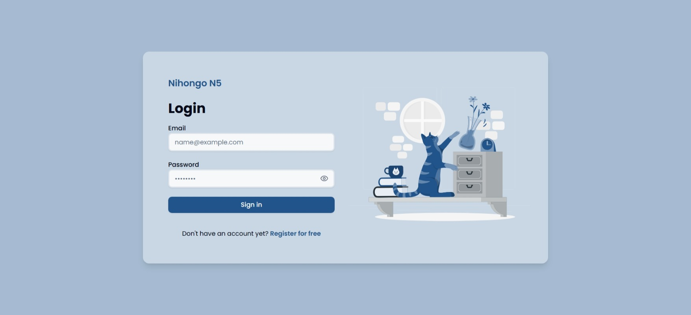
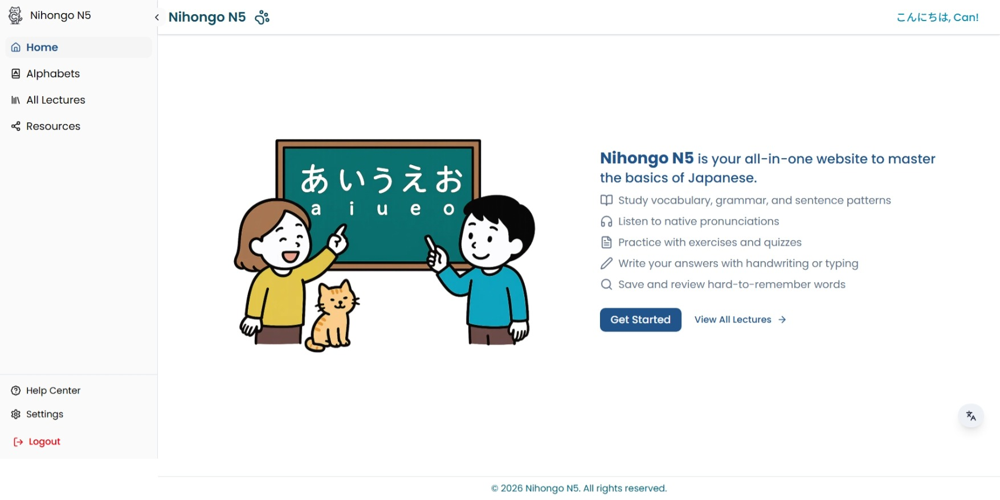
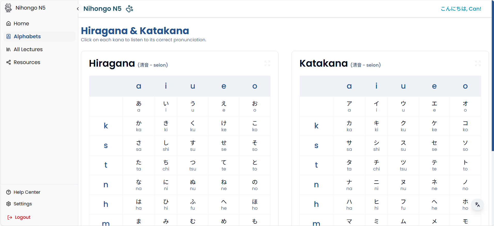
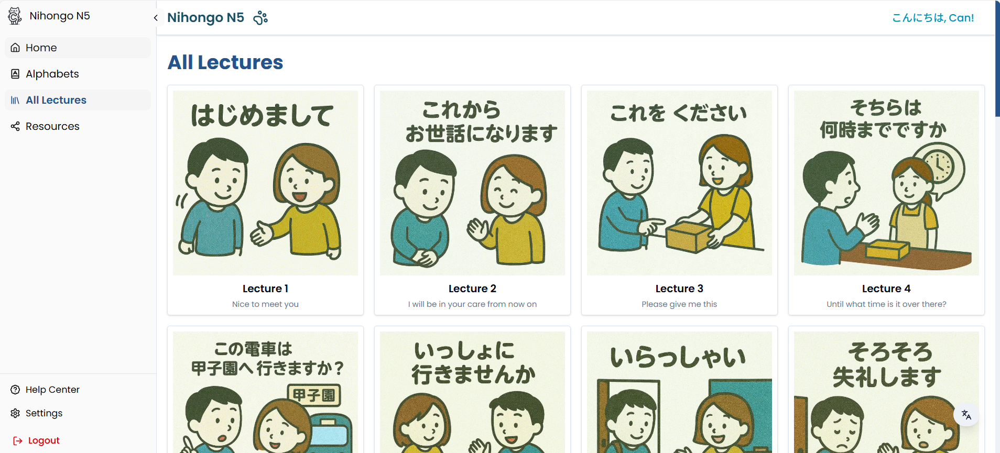
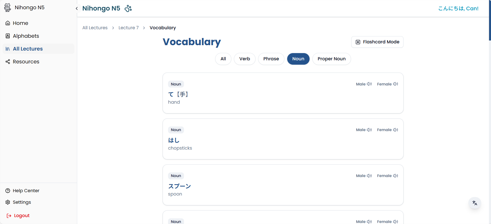
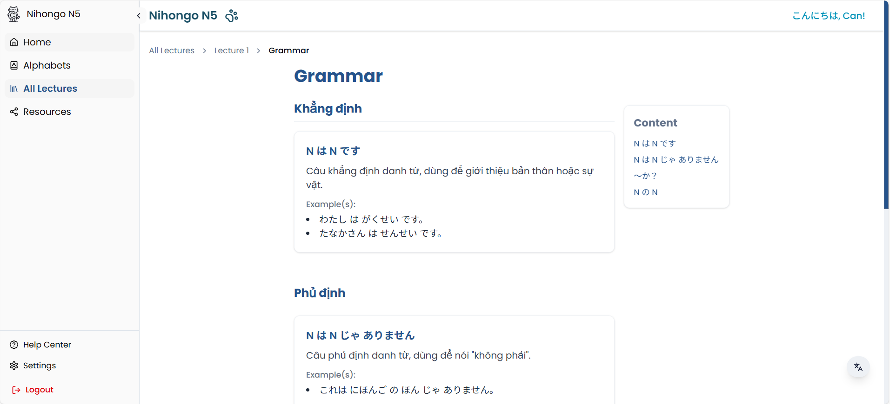
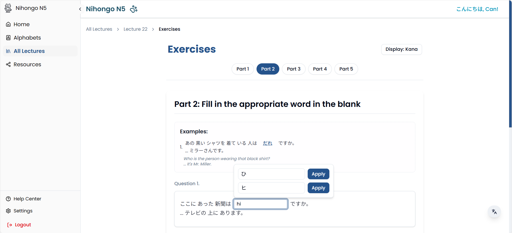
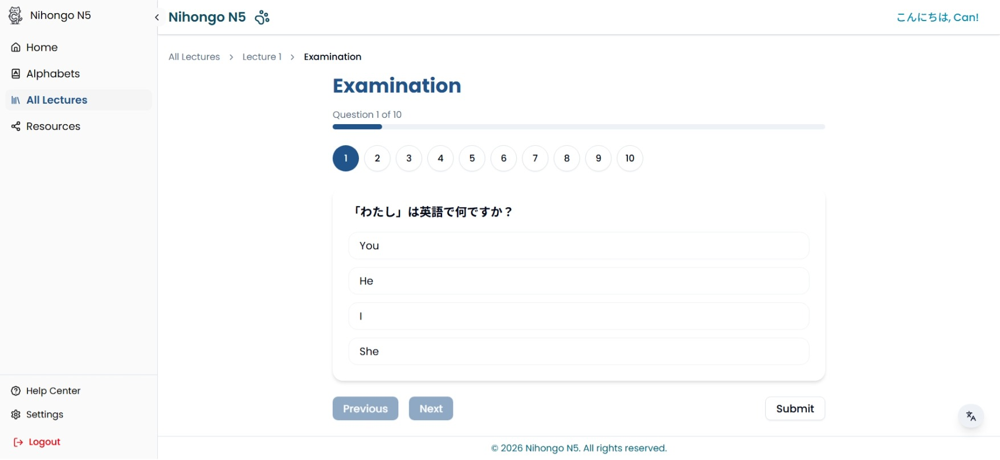
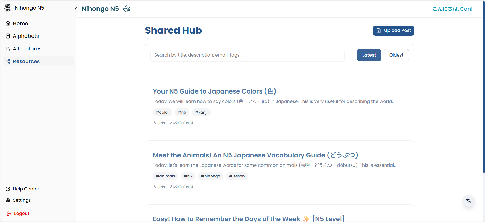
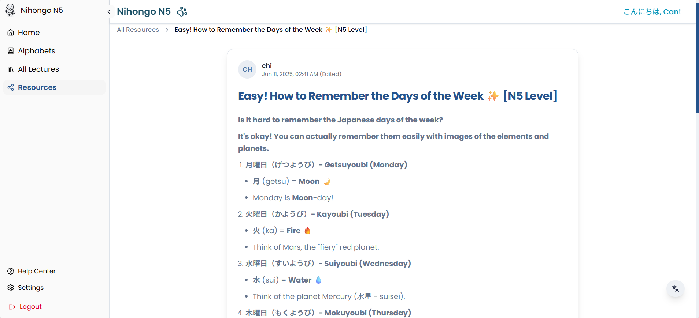

<div align="center">
  
</div>

<div align="center">
    <h1>NIHONGO-N5</h1> 
    <strong>Nihongo-N5</strong> is a Japanese language e-learning web application designed for beginners preparing for the <strong>JLPT N5</strong> level. The platform provides structured lessons, vocabulary, grammar explanations, and practice exercises with a clean, accessible, and responsive UI.
</div>

## 📋 Table of Content

1. [Introduction](#introduction)
2. [Getting started](#getting-started)
3. [Technologies Used](#technologies-used)
4. [UI Interface](#ui-interface)
5. [References](#references)
6. [MIT License](#mit-license)

<!-- Introduction -->
## 🪧 Introduction <a name="introduction"></a>
### 🔗 Link Demo: [nihongo-n5](https://nihongo-n5.vercel.app/)
**Nihongo-N5** is a self-learning platform aimed at Japanese language beginners. It focuses on core JLPT N5 knowledge, including basic vocabulary, grammar points, and sentence structures. Learners can study at their own pace while tracking progress through authenticated user accounts.

The project was developed as a **personal learning and pre-thesis project**, emphasizing both educational value and modern web development practices.

## 🚀 Getting started <a name="getting-started"></a>

### 🎯 Installation
1. **Clone the repository:**
     ```bash
     git clone https://github.com/yeenci/nihongo-n5.git
     cd nihongo-n5
     ```
2. **Install dependencies:**
     ```bash
     npm install
     ```

### 💨 Running the Application
1. **Start the application:**
     ```bash
     npm run dev
     ```
2. **Open in browser:**  
Navigate to `http://localhost:3000` to start learning Japanese.

## ⚙️ Technologies Used <a name="technologies-used"></a>

| Stack | Usage |
|------|------|
| **Next.js** | Server-side rendering and modern React framework |
| **React.js** | Component-based UI development |
| **TailwindCSS** | Responsive, utility-first styling |
| **Firebase Auth** | User authentication and account management |
| **Firebase Firestore** | Storing user progress and learning data |
| **Backblaze B2** | Media and learning content storage |
| **ShadCN UI** | Accessible and reusable UI components |
| **Vercel** | Deployment and hosting |

## 🎇 UI Interface <a name="ui-interface"></a>

### 🗝️ Login UI:
<div align="center">
    
</div>

### 🏠 Homepage UI:
<div align="center">
    
</div>

### 🅰️ Alphabets UI:
<div align="center">
    
</div>

### 📘 All Lectures UI:
<div align="center">
    
</div>

### 📖 Lesson UI:
<div align="center">
    
</div>

### 🈁 Vocabulary UI:
<div align="center">
    
</div>

### 🧠 Grammar UI:
<div align="center">
    
</div>

### 📋 Exercises UI:
<div align="center">
    
</div>

### 💯 Examination UI:
<div align="center">
    
</div>

### 🎋 All Resources UI:
<div align="center">
    
</div>

### 📇 Post UI:
<div align="center">
    
</div>

## 📚 References <a name="references"></a>

- [JLPT Official Website](https://www.jlpt.jp/e/)
- [Next.js Documentation](https://nextjs.org/docs)
- [Firebase Documentation](https://firebase.google.com/docs)
- [Vnjpclub - Learn Japanese Online](https://www.vnjpclub.com/minna-no-nihongo/)
- Japanese learning materials adapted from public N5-level resources

## 📜 License <a name="license"></a>

This project is licensed under the [MIT License](https://github.com/chihiro-203/nihongo-n5/blob/main/LICENSE).
